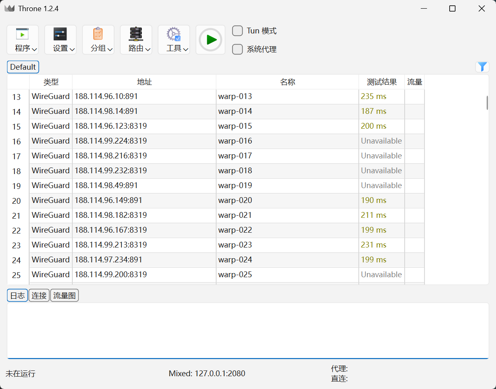
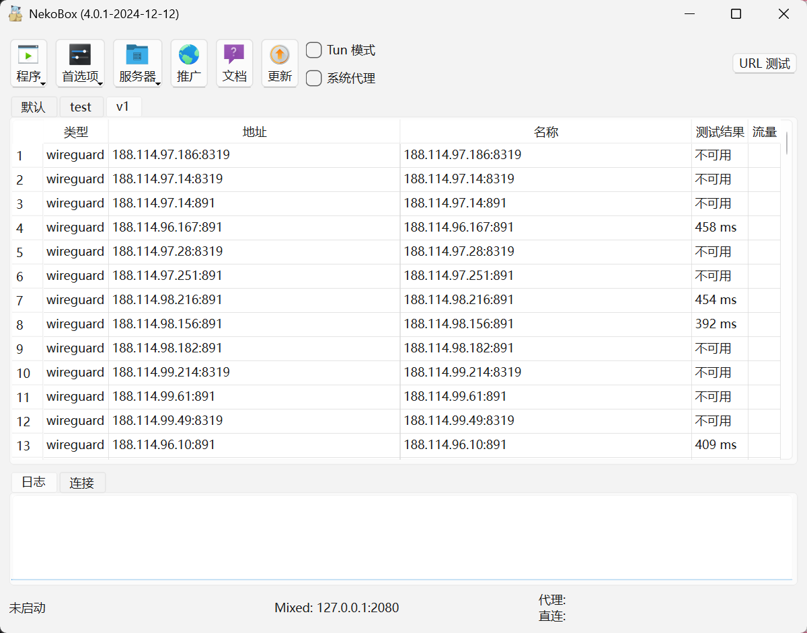
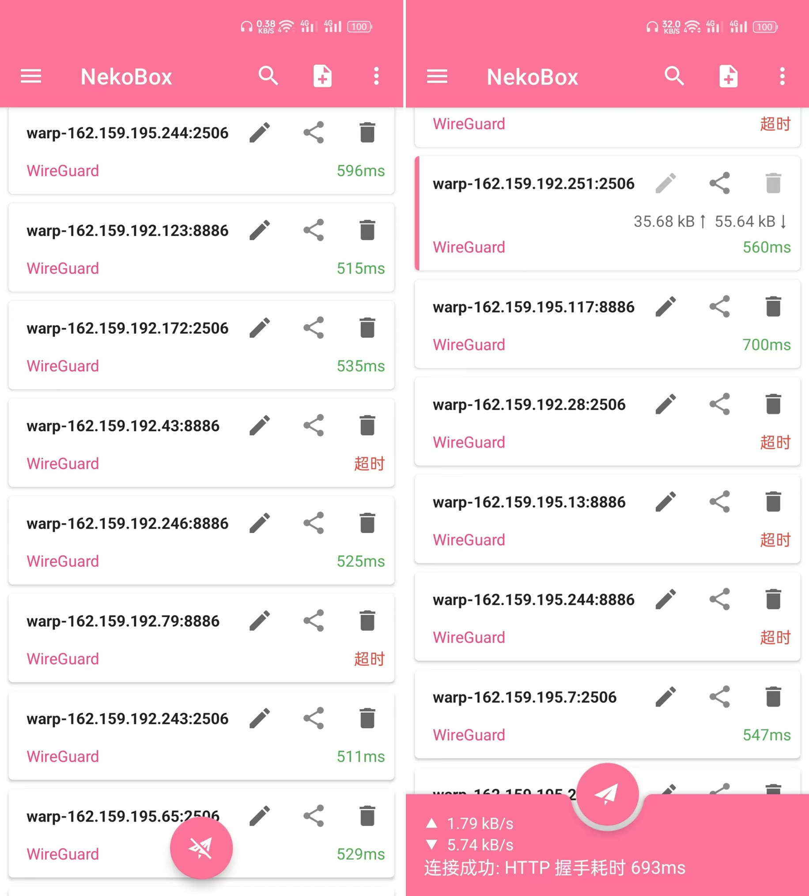
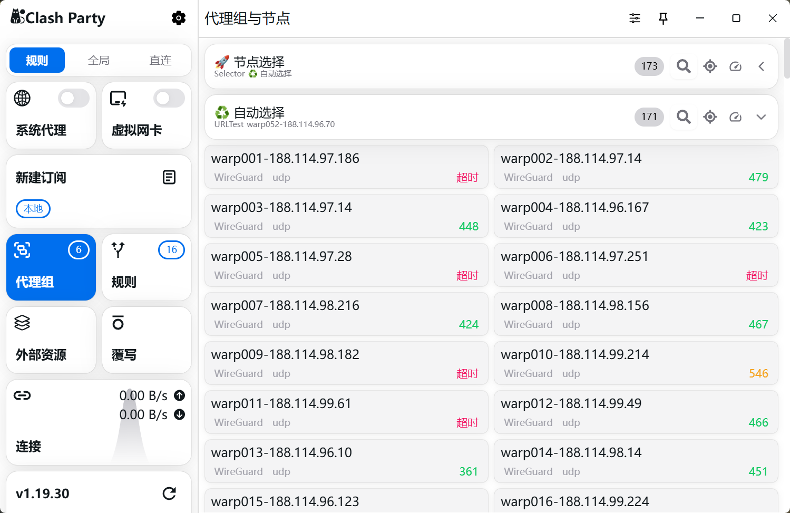
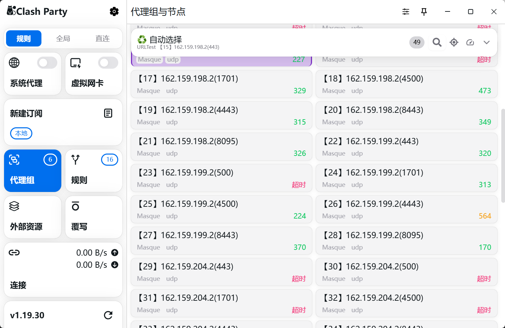

# cfwarp-converter

cfwarp转换工具集，将 Cloudflare WARP 官方的 WireGuard 和 Masque 协议接口转换到第三方代理软件中使用。

### 一、支持

1、sing-box内核代表

+ [Throne (Formerly Nekoray)](https://github.com/throneproj/Throne)
+ [NekoBox for Android](https://github.com/MatsuriDayo/NekoBoxForAndroid)
+ [NyameBox / NekoBox for PC](https://github.com/qr243vbi/nekobox)（导入程序测试，发现很多不可用，不推荐使用它）
+ [nekoray / NekoBox For PC（早期版本）](https://github.com/MatsuriDayo/nekoray)（停止更新了，不推荐使用它）
+ ……

2、xray内核代表

+ [v2rayN](https://github.com/2dust/v2rayN)
+ [v2rayNG](https://github.com/2dust/v2rayNG)
+ ……

3、mihomo（clash.meta）内核代表

+ [Clash Party](https://github.com/mihomo-party-org/clash-party)
+ [Clash Meta for Android](https://github.com/MetaCubeX/ClashMetaForAndroid)
+ [FlClash](https://github.com/chen08209/FlClash)
+ [Clash Mi](https://github.com/KaringX/clashmi)
+ [Pandora-Box](https://github.com/snakem982/Pandora-Box)
+ [Clash Verge rev](https://github.com/clash-verge-rev/clash-verge-rev)
+ ……

温馨提示：

1、如果你使用的代理软件，不在上面所列范围，也可能能使用，取决要执行的内核是否支持WireGuard或Masque，是否要节点转换(订阅转换)，自己动脑判断/处理。

2、目前只发现mihomo内核支持masque，也有人生成`masque://`的链接，还未发现提供哪个app软件使用，找到支持masque的app，手动将参数填上去，测试无延迟，不能使用的，没有深度测试。

3、目前不支持转换为纯json配置的xray和sing-box。

4、需要使用其他工具优选IP地址，替换文件 `ip.txt` 和 `result.csv` 的数据使用。

### 二、使用

以Windows为例，执行下面命令，其它系统自己探索。

```cmd
# 检查本机是否安装python，没有就安装，不懂就问AI怎么安装python
python --version
python3 --version

# 创建虚拟环境，项目依赖隔离
python -m venv venv

# 激活虚拟环境
venv\Scripts\activate
.\venv\Scripts\Activate.ps1 # 使用 PowerShell

# 升级 pip，避免安装依赖时，提示要升级 pip
python -m pip install --upgrade pip

# 安装依赖
pip install -r requirements.txt
pip install -r requirements.txt -i https://pypi.tuna.tsinghua.edu.cn/simple # 如果下载速度较慢，可以使用国内镜像源

# 执行指定的python脚本，看python文件名就知道功能了
python 0.注册wg和masque账号.py
....
```

前面执行一遍，下次再使用，就执行：

```cmd
# 激活虚拟环境(上次执行命令，已经将依赖安装好)
venv\Scripts\activate

# 选择想运行的python脚本（*.py）
python 0.注册wg和masque账号.py
....
```

注意：注册wg和masque账号的，请勿滥用，不要使劲薅。

### 三、截图





.png)







### 四、忠告

非官方承认的工具，非法接入，大量并发连接，可能导致短/长时间所有都不能连接 Cloudflare WARP 服务器使用，或者本地网络提供商发现异常阻断，敏感期网络提供商阻断IP段，也有可能，**能否使用看你当地网络情况。**

